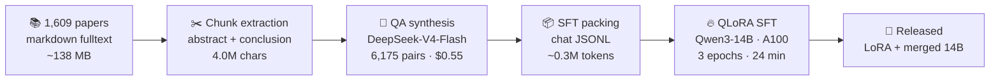

<div align="center">

# GPT-Flux

**A domain-specialized Chinese Q&A model for geoscience & flux-tower research**

*Qwen3-14B · QLoRA fine-tuned on 6,175 QA pairs synthesized from 1,609 peer-reviewed papers*

[](https://huggingface.co/LonghaoWang/flux-gpt-qwen3-14b-merged)
[](https://huggingface.co/datasets/LonghaoWang/flux-sft)
[](LICENSE)
[](requirements.txt)

[中文版](README_zh.md) · [Methodology](docs/methodology.md) · [Training](docs/training.md) · [Q&A Showcase](examples/showcase_qa.md)

</div>

---

## Abstract

General-purpose LLMs are fluent but shallow on specialized science. **GPT-Flux**
closes that gap for a concrete domain: **eddy-covariance flux towers and the
carbon–water–energy science built on them**.

Starting from a private collection of thousands of flux-tower papers, we:

1. **Extract** salient chunks (abstract + conclusion) from 1,609 papers,
2. **Synthesize** 6,175 Chinese question–answer pairs with an instruction-tuned LLM,
3. **Fine-tune** Qwen3-14B with **QLoRA** (4-bit NF4, r=64) on a single A100 in ~24 minutes.

The result is a professional knowledge assistant that answers domain questions —
from eddy-covariance corrections to energy-balance closure — with the vocabulary
and precision of the literature it was trained on. Total compute cost: **~$2.6**.

## Pipeline



Details: [docs/methodology.md](docs/methodology.md) · [docs/training.md](docs/training.md) · [docs/data.md](docs/data.md)

## Results

| Metric | Value |
|---|---|
| Training samples | 6,175 Chinese QA pairs |
| Source papers | 1,609 peer-reviewed |
| Base model | Qwen3-14B (Apache 2.0) |
| Method | QLoRA · 4-bit NF4 · r=64 / α=128 · all-linear |
| Hardware | 1× A100 80GB (Hugging Face Jobs) |
| Train time | ~24 min (3 epochs) |
| Final train loss | **1.76** (smoke test: 2.66 → healthy convergence) |
| Throughput | ~1,620 tok/s |
| GPU cost | **~$2.6** |
| QA synthesis cost | **$0.55** (HF Pro free inference credits) |

## Quickstart

```bash
pip install -r requirements.txt
```

**Chat (merged 14B, needs ~30GB VRAM or 4-bit mode):**

```python
from transformers import pipeline
pipe = pipeline("text-generation",
                model="LonghaoWang/flux-gpt-qwen3-14b-merged",
                device_map="auto", torch_dtype="auto")
pipe([{"role": "user", "content": "涡度相关法测量碳通量有哪些主要误差来源？"}],
     max_new_tokens=512)
```

**4-bit mode (single RTX 4090 / free Colab T4):**

```bash
python src/inference.py --q "什么是能量平衡闭合问题？" --load-in-4bit
```

Or open the interactive Colab demo: [`notebooks/demo_colab.ipynb`](notebooks/demo_colab.ipynb)

**Reproduce training:**

```bash
python src/train.py   # defaults = v1 config (configs/qlora.yaml)
```

## Q&A Showcase

> Base vs fine-tuned, same questions, same decoding (temperature=0, 2–4 sentences).
> Curated winning examples: [examples/model_comparison.md](examples/model_comparison.md)

**Q:** 在涡度相关通量测量中，随机误差的主要来源有哪些？

**Qwen3-14B（基座）：** 涡度相关通量测量中的随机误差主要来源于传感器噪声、湍流脉动的不完全采样以及仪器安装和环境因素引起的瞬时扰动。此外，数据采集频率不足和信号处理中的滤波误差也会引入随机误差。

**GPT-Flux v1（微调后）：** 主要来源包括：湍流脉动的不完全采样（incomplete sampling of turbulent fluctuations）、仪器噪声（instrument noise）、以及数据处理中的插值和滤波误差（interpolation and filtering errors during data processing）。

**Q:** 与传统的间接和离散通量测量方法相比，eddy covariance 技术测量河流 CO₂ 和 CH₄ 通量有何主要优势？

**Qwen3-14B（基座）：** Eddy covariance 技术能够直接、连续地测量河流表面CO₂和CH₄的通量，避免了传统方法的采样干扰和滞后问题。它基于湍流脉动的瞬时相关性，具有较高的时空分辨率和代表性。此外，该方法无需复杂的采样系统，适用于大范围和长期监测。

**GPT-Flux v1（微调后）：** eddy covariance 技术能够提供高时间分辨率的连续通量测量，避免了间接方法的假设和离散采样的局限性，从而更准确地捕捉河流温室气体通量的动态变化。

## Project structure

```
GPT-Flux/
├── README.md / README_zh.md   # this file / 中文版
├── configs/qlora.yaml         # v1 training configuration
├── docs/                      # methodology · training · data card
├── examples/                  # Q&A showcase + sample training data
├── notebooks/demo_colab.ipynb # free-GPU interactive demo
└── src/
    ├── train.py               # QLoRA training (reproduces v1)
    ├── inference.py           # chat CLI
    └── build_sft.py           # papers → SFT data pipeline
```

## Roadmap

- [x] v1 — 6,175 QA pairs, Qwen3-14B QLoRA, released
- [ ] v2 — domain filtering (remove off-domain papers), larger QA set
- [ ] Evaluation benchmark — held-out domain QA test set
- [ ] Online demo (HF Space)

## Limitations

- v1 contains a small number of off-domain papers (e.g. astronomy) — filtered in v2.
- Short-answer style; verify critical facts against primary literature.
- Inherits base-model knowledge cutoff and general LLM limitations.

## Citation

```bibtex
@software{gptflux2026,
  title  = {GPT-Flux: A Domain-Specialized Chinese Q\&A Model for Geoscience and Flux-Tower Research},
  author = {Wang, Longhao},
  year   = {2026},
  url    = {https://github.com/LonghaoWang/GPT-Flux}
}
```

See [CITATION.cff](CITATION.cff). Model weights: Apache 2.0 (base) — fine-tuned adapter released under Apache 2.0.

---

<div align="center">
Built from 1,609 papers · Trained on 1 GPU · <b>Total cost $3.15</b>
</div>
