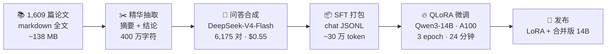

<div align="center">

# GPT-Flux

**面向地学与通量站研究的中文专业问答模型**

*Qwen3-14B · QLoRA 微调 · 1,609 篇同行评审论文合成 6,175 条问答对*

[](https://huggingface.co/LonghaoWang/flux-gpt-qwen3-14b-merged)
[](https://huggingface.co/datasets/LonghaoWang/flux-sft)
[](LICENSE)

[English](README.md) · [方法论](docs/methodology.md) · [训练细节](docs/training.md) · [问答展示](examples/showcase_qa.md)

</div>

---

## 简介

通用大模型能言善辩，但在专业科学问题上往往深度不够。**GPT-Flux** 针对一个具体领域补上这一课：**涡度相关通量站，以及建立在其上的碳–水–能量科学**。

我们从上千篇通量站文献出发：

1. **抽取** — 从 1,609 篇论文全文中提取摘要 + 结论等精华片段；
2. **合成** — 用指令微调大模型生成 6,175 条中文问答对；
3. **微调** — 在单张 A100 上用 **QLoRA** 微调 Qwen3-14B，约 24 分钟完成。

最终得到一个专业知识助手：从涡度相关订正到能量平衡闭合，都能用文献级的词汇和精度作答。**总算力成本约 $2.6**。

## 技术路线



详细文档：[docs/methodology.md](docs/methodology.md) · [docs/training.md](docs/training.md) · [docs/data.md](docs/data.md)

## 关键结果

| 指标 | 数值 |
|---|---|
| 训练样本 | 6,175 条中文问答对 |
| 来源论文 | 1,609 篇同行评审 |
| 基座模型 | Qwen3-14B（Apache 2.0） |
| 微调方法 | QLoRA · 4-bit NF4 · r=64 / α=128 · all-linear |
| 硬件 | 1× A100 80GB（Hugging Face Jobs 云端训练） |
| 训练时长 | 约 24 分钟（3 epoch） |
| 最终 loss | **1.76**（smoke 测试 2.66 → 收敛健康） |
| GPU 花费 | **约 $2.6** |
| 问答合成花费 | **$0.55**（HF Pro 免费推理额度） |

## 快速上手

```bash
pip install -r requirements.txt
```

**对话（合并版 14B，需 ~30GB 显存或 4-bit 模式）：**

```python
from transformers import pipeline
pipe = pipeline("text-generation",
                model="LonghaoWang/flux-gpt-qwen3-14b-merged",
                device_map="auto", torch_dtype="auto")
pipe([{"role": "user", "content": "涡度相关法测量碳通量有哪些主要误差来源？"}],
     max_new_tokens=512)
```

**4-bit 模式（单张 RTX 4090 / 免费 Colab T4 即可）：**

```bash
python src/inference.py --q "什么是能量平衡闭合问题？" --load-in-4bit
```

或直接打开 Colab 交互演示：[`notebooks/demo_colab.ipynb`](notebooks/demo_colab.ipynb)

**复现训练：**

```bash
python src/train.py   # 默认即 v1 配置（configs/qlora.yaml）
```

## 问答效果展示

> 基座 vs 微调，同一问题、同一解码参数（temperature=0，2–4 句话）。
> 精选获胜案例：[examples/model_comparison.md](examples/model_comparison.md)

**问：** 在涡度相关通量测量中，随机误差的主要来源有哪些？

**Qwen3-14B（基座）：** 涡度相关通量测量中的随机误差主要来源于传感器噪声、湍流脉动的不完全采样以及仪器安装和环境因素引起的瞬时扰动。此外，数据采集频率不足和信号处理中的滤波误差也会引入随机误差。

**GPT-Flux v1（微调后）：** 主要来源包括：湍流脉动的不完全采样（incomplete sampling of turbulent fluctuations）、仪器噪声（instrument noise）、以及数据处理中的插值和滤波误差（interpolation and filtering errors during data processing）。

**问：** 与传统的间接和离散通量测量方法相比，eddy covariance 技术测量河流 CO₂ 和 CH₄ 通量有何主要优势？

**Qwen3-14B（基座）：** Eddy covariance 技术能够直接、连续地测量河流表面CO₂和CH₄的通量，避免了传统方法的采样干扰和滞后问题。它基于湍流脉动的瞬时相关性，具有较高的时空分辨率和代表性。此外，该方法无需复杂的采样系统，适用于大范围和长期监测。

**GPT-Flux v1（微调后）：** eddy covariance 技术能够提供高时间分辨率的连续通量测量，避免了间接方法的假设和离散采样的局限性，从而更准确地捕捉河流温室气体通量的动态变化。

## 项目结构

```
GPT-Flux/
├── README.md / README_zh.md   # 说明文档（英文 / 中文）
├── configs/qlora.yaml         # v1 训练配置
├── docs/                      # 方法论 · 训练细节 · 数据卡
├── examples/                  # 问答展示 + 训练数据样例
├── notebooks/demo_colab.ipynb # 免费 GPU 交互演示
└── src/
    ├── train.py               # QLoRA 训练脚本（复现 v1）
    ├── inference.py           # 对话命令行工具
    └── build_sft.py           # 论文 → SFT 数据流水线
```

## 路线图

- [x] v1 — 6,175 问答对，Qwen3-14B QLoRA，已发布
- [ ] v2 — 领域过滤（剔除非地学论文）、更大问答集
- [ ] 评测基准 — 留出领域问答测试集
- [ ] 在线演示（Hugging Face Space）

## 局限性

- v1 混入少量非地学论文（如天文），v2 将过滤；
- 回答偏简洁 factual 风格，关键结论请核对原始文献；
- 继承基座模型的知识截止与通用 LLM 局限。

## 引用

```bibtex
@software{gptflux2026,
  title  = {GPT-Flux: A Domain-Specialized Chinese Q\&A Model for Geoscience and Flux-Tower Research},
  author = {Wang, Longhao},
  year   = {2026},
  url    = {https://github.com/LonghaoWang/GPT-Flux}
}
```

---

<div align="center">
1,609 篇论文 · 1 张 GPU · <b>总成本 $3.15</b>
</div>
