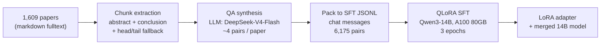

# Methodology — From Papers to a Domain GPT

This document describes the full pipeline used to build GPT-Flux v1:
turning **1,609 peer-reviewed geoscience / flux-tower papers** into a
**Chinese Q&A specialist** via QLoRA fine-tuning of Qwen3-14B.

## 1. Corpus

| Item | Detail |
|---|---|
| Source | Author's curated literature collection (legally obtained PDFs) |
| Papers with clean fulltext | 1,813 markdown conversions |
| Papers used for v1 | 1,609 (abstract/conclusion extractable) |
| Domains | Eddy-covariance flux towers, carbon-water-energy exchange, ecohydrology, remote sensing, micrometeorology |
| Raw text | ~138 MB markdown |

> **Copyright note:** the corpus itself is private and is *not* redistributed.
> Only the derived, transformed QA pairs (short, paraphrased) are used for training.
> The public training set and model contain no verbatim paper text.

## 2. Pipeline



### Step 1 — Salient chunk extraction (`src/build_sft.py::extract_chunks`)

Full papers are too long and too noisy for direct QA synthesis (references,
supplements, boilerplate). For each paper we extract:

1. The **Abstract** section (research question + key findings),
2. The **Conclusion/Summary** section (takeaways),
3. Fallback: head + tail of the body when section headers are non-standard.

Result: ~4.0M characters of dense, information-rich chunks (~1.1M tokens).

### Step 2 — QA synthesis

An instruction-tuned LLM reads each chunk and writes ~4 Chinese QA pairs
covering *methods, results, mechanisms, and applications* from different angles.
Constraints in the synthesis prompt:

- Questions must be specific and deep, not generic;
- Answers must be grounded in the chunk — no hallucinated content;
- Output is strict JSON for automatic parsing.

v1 synthesis: **DeepSeek-V4-Flash** via Hugging Face Inference Providers,
16-way parallel with resume support and a hard budget fuse.
Cost: **$0.55** (within the $2/month free Pro inference credits — zero cash spend).

### Step 3 — SFT packing

Pairs are packed into the standard chat format expected by TRL's `SFTTrainer`:

```json
{"messages": [
  {"role": "user", "content": "涡度相关法测量碳通量有哪些主要误差来源？"},
  {"role": "assistant", "content": "……"}
]}
```

Final v1 set: **6,175 pairs**, ~1.0M characters (~0.3M tokens).
See `examples/sample_qa.jsonl` for real samples and
`examples/showcase_qa.md` for a curated showcase.

## 3. Why this works

- **Dense supervision**: abstract+conclusion chunks concentrate each paper's
  core claims, so every QA pair teaches a real domain fact.
- **Diverse angles**: 4 pairs/paper across methods/results/mechanisms/applications
  prevent the model from memorizing a single phrasing.
- **Grounded answers**: the synthesis prompt forbids inventing content beyond
  the chunk, keeping the supervision signal clean.

## 4. Known limitations (v1)

- A small number of **non-geoscience papers** (e.g. astronomy) slipped into the
  corpus through keyword matching; v2 will add a domain filter.
- Answers are concise (avg. ~115 Chinese characters) — good for factual QA,
  less suited for long-form exposition.
- The model inherits the base model's knowledge cutoff and general limitations;
  verify critical facts against primary literature.
